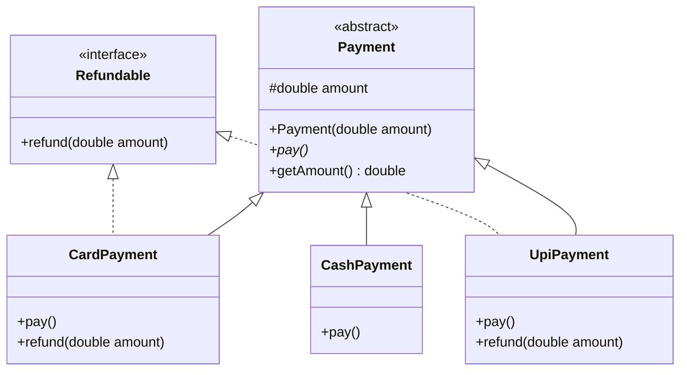

# Payment System UML

```mermaid
classDiagram
    class Payment {
        <<abstract>>
        #double amount
        +Payment(double amount)
        +pay()*
        +getAmount() double
    }

    class Refundable {
        <<interface>>
        +refund(double amount)
    }

    class CardPayment {
        +pay()
        +refund(double amount)
    }

    class UpiPayment {
        +pay()
        +refund(double amount)
    }

    class CashPayment {
        +pay()
    }

    Payment <|-- CardPayment
    Payment <|-- UpiPayment
    Payment <|-- CashPayment
    Refundable <|.. CardPayment
    Refundable <|.. UpiPayment
```
